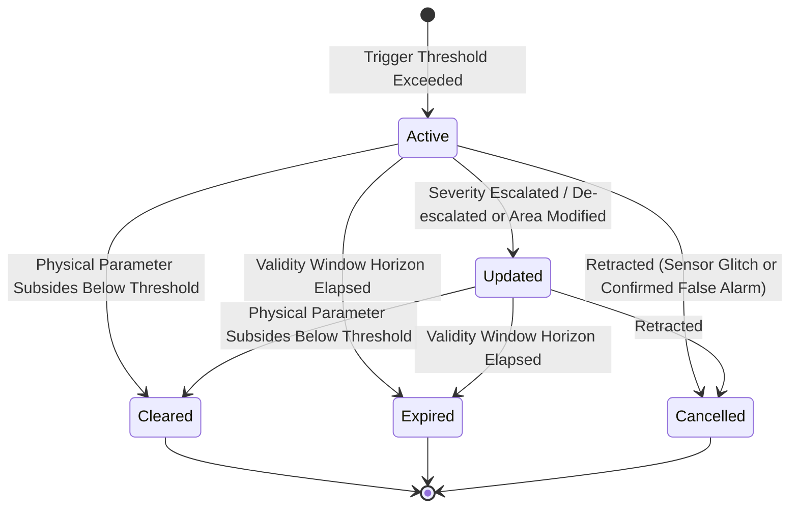

# Alert and Severity Taxonomy Specification

**Project:** Satellite-Based Multi-Hazard Disaster Risk Prediction and Early Warning System Using AI/ML
**Phase:** Phase 2 — Requirements and UX Workflow
**Document Ownership:** Authoritative technical specification for disaster alert definitions, Common Alerting Protocol (CAP v1.2) mapping, provisional physical thresholds, and the alert lifecycle state machine.
**Governance State:** Provisional Engineering Proposal (`PENDING_SUPERVISOR_REVIEW`).
**Cross-References:** Scope charter in [project-scope.md](file:///Users/salman/Desktop/satellite-disaster/docs/project-scope.md), Hazard definitions in [hazard-task-definitions.md](file:///Users/salman/Desktop/satellite-disaster/docs/hazard-task-definitions.md), API Contracts in [api-contracts-spec.md](file:///Users/salman/Desktop/satellite-disaster/docs/api-contracts-spec.md), Decision log in [decision-log.md](file:///Users/salman/Desktop/satellite-disaster/docs/decision-log.md).

---

## 1. Common Alerting Protocol (CAP v1.2) Alignment & Alert Tier Separation

### 1.1 Strict Separation of CAP Fields from User Alert Tiers
The international standard **OASIS Common Alerting Protocol (CAP v1.2 / ITU-T X.1303)** defines a digital data schema for emergency warning interchange.

CAP v1.2 does **not** define "Advisory", "Watch", or "Warning" as its severity field values. CAP v1.2 standardizes three distinct, orthogonal classification enumerations:

1. **`severity`:** The seriousness of the expected or observed event.
   * Standard values: `Extreme` | `Severe` | `Moderate` | `Minor` | `Unknown`
2. **`urgency`:** The time sensitivity of the required responsive action.
   * Standard values: `Immediate` | `Expected` | `Future` | `Past` | `Unknown`
3. **`certainty`:** The estimated probability or observational verification of occurrence.
   * Standard values: `Observed` | `Likely` | `Possible` | `Unlikely` | `Unknown`

### 1.2 Proposed Operational Alert Tier Mapping (Provisional Design Proposal)
The terms **Advisory**, **Watch**, and **Warning** are user-facing operational categories established in national emergency and meteorological frameworks (e.g., US National Weather Service, India Meteorological Department, WMO Early Warning Guidelines).

In this system, they represent a **synthesized user-facing presentation tier** derived from the underlying CAP elements:

```text
┌────────────────────────────────────────────────────────┐
│               CAP v1.2 Data Elements                   │
│   severity   │   Extreme, Severe, Moderate, Minor      │
│   urgency    │   Immediate, Expected, Future, Past     │
│   certainty  │   Observed, Likely, Possible, Unlikely  │
└───────────────────────────┬────────────────────────────┘
                            │
               [PROVISIONAL SYNTHESIS MAPPING]
             (Flagged: PENDING_SUPERVISOR_REVIEW)
                            │
                            ▼
┌────────────────────────────────────────────────────────┐
│            Synthesized User-Facing Alert Tiers         │
│  [ WARNING  ] ──► Critical event observed/imminent     │
│  [  WATCH   ] ──► Favorable conditions; event likely   │
│  [ ADVISORY ] ──► Elevated conditioning factor present │
└────────────────────────────────────────────────────────┘
```

| Synthesized User-Facing Tier | Target Operational Meaning | Proposed Mapping from Underlying CAP v1.2 Elements | Proposed UI Color & Token |
| :--- | :--- | :--- | :--- |
| **Warning** | Critical hazard condition observed or imminent; protective action required. | `severity` $\in \{\text{Extreme}, \text{Severe}\}$ AND `urgency` $\in \{\text{Immediate}, \text{Expected}\}$ AND `certainty` $\in \{\text{Observed}, \text{Likely}\}$ | Red (`#ef4444`) |
| **Watch** | Atmospheric/hydrological conditions favorable for hazardous event; timing or spatial footprint uncertain. | `severity` $\in \{\text{Extreme}, \text{Severe}\}$ AND `urgency` $\in \{\text{Future}, \text{Expected}\}$ AND `certainty` $\in \{\text{Possible}, \text{Likely}\}$ | Orange (`#f97316`) |
| **Advisory** | Elevated environmental conditioning factors present that warrant heightened vigilance, but expected impact is sub-critical. | `severity` $\in \{\text{Moderate}, \text{Minor}\}$ AND `urgency` $\in \{\text{Expected}, \text{Future}\}$ AND `certainty` $\in \{\text{Likely}, \text{Possible}\}$ | Yellow (`#eab308`) |
| **Informational** | Routine background observation; normal baseline conditions. | `severity` = `Minor` OR `severity` = `Unknown` | Slate (`#64748b`) |

*Governance Notice:* This mapping is an unverified engineering proposal. CAP does **not** dictate hazard-specific physical thresholds. The mapping is marked **`PENDING_SUPERVISOR_REVIEW`**.

---

## 2. Multi-Hazard Provisional Physical Thresholds & Research Status

All numerical thresholds listed below are provisional proposals from literature. None are operational rules. Each requires calibration against verified regional ground truth during Phase 6.

### 2.1 Threshold Proposal Table

| Hazard ID | Physical Variable, Units & Timescale | Proposed Advisory | Proposed Watch | Proposed Warning | Authoritative Basis & Context | Geographic Applicability & Scientific Limitations |
| :--- | :--- | :--- | :--- | :--- | :--- | :--- |
| **Flood** (`flood`) | Antecedent Precipitation Index (API, 3–7 day, mm) & SAR surface water fraction | Catchment API $\ge 70\text{th}$ percentile | 24h precipitation forecast $\ge 75\text{ mm}$ over high susceptibility zone | Sentinel-1 SAR surface water anomaly $\ge 15\%$ above permanent JRC baseline | Copernicus Emergency Management Service Rapid Mapping Guidelines; Brakenridge (Dartmouth Flood Observatory) | Applicable to alluvial river basins. **Limitations:** Fails in dense forest canopies (C-band invisible) and urban built-up areas (radar double-bounce). |
| **Wildfire** (`wildfire`) | Fire Weather Index (FWI) proxy (daily) & VIIRS Fire Radiative Power (MW) | Daily FWI proxy $> 15$ (High danger rating) | Daily FWI proxy $> 30$ (Very High danger rating); 10m Wind $\ge 30\text{ km/h}$ | VIIRS (VNP14IMGTDL) confidence $\ge 80\%$ AND FRP $\ge 50\text{ MW}$ | Canadian Forest Fire Danger Rating System (Van Wagner 1987); NASA FIRMS Active Fire Product User Guide (Schroeder et al. 2014) | Formulated for boreal/temperate forests; tropical dry deciduous belts require regional fuel model calibration. **Limitation:** Hotspots detect active combustion, not future ignition. |
| **Landslide** (`landslide`) | Static slope susceptibility class & Cumulative rainfall ($I\text{--}D$ threshold, mm/day) | Susceptibility class: High or Very High (Copernicus DEM slope $\ge 25^\circ$) | 3-day antecedent rainfall $\ge 100\text{ mm}$ (ERA5 / GPM) | 24h rainfall intensity $\ge 50\text{ mm/day}$ on High Susceptibility slope | Guzzetti et al. (2008) Rainfall Thresholds for Shallow Landslides; Geological Survey of India NLSM | Valid strictly for rainfall-triggered shallow landslides in mountainous relief (e.g. Western Ghats). **Limitation:** Does not predict earthquake-induced slope failures or deep-seated bedrock motion. |
| **Drought** (`drought`) | Standardized Precipitation-Evapotranspiration Index (SPEI-1, SPEI-3) & Vegetation Health Index (VHI) | $-1.0 \ge \text{SPEI} > -1.5$ (Mild Drought) | $-1.5 \ge \text{SPEI} > -2.0$ (Severe Drought); $\text{VHI} < 35$ | $\text{SPEI} \le -2.0$ (Extreme Drought); $\text{VHI} < 20$ for 4+ consecutive weeks | McKee et al. (1993); Vicente-Serrano et al. (2010); Kogan (1995) VHI | Valid for rainfed agricultural zones. **Limitation:** Decouples in canal-irrigated croplands where artificial irrigation preserves high NDVI despite severe meteorological precipitation deficit. |
| **Cyclone** (`cyclone`) | Maximum Sustained Wind Speed (knots) & 48h/24h Coastal Landfall Strike Cone | Deep depression: $28\text{--}33\text{ kts}$ | Cyclonic Storm: $34\text{--}47\text{ kts}$; 48h coastal strike cone | Severe Cyclonic Storm: $\ge 48\text{ kts}$; 24h coastal landfall zone | WMO-No. 528 Tropical Cyclone Operational Plan; India Meteorological Department Cyclone Manual | Tropical oceanic basins. **Limitation:** Mandates numerical weather prediction (NWP) steering flow and geostationary imagery. Polar satellite snapshots cannot track storm progression. |
| **Severe Storm** (`severe_storm`) | Convective Available Potential Energy (CAPE, $\text{J/kg}$) & Radar Reflectivity ($dBZ$) | CAPE $\ge 1500\text{ J/kg}$; Lifted Index $< -3$ | Geostationary IR cloud-top cooling rate $\ge 4\text{ K / 15 min}$ | Doppler Radar Reflectivity $\ge 45\text{ dBZ}$; Lightning flash density burst | Doswell et al. (1996) Severe Convective Storms; NOAA NWS Criteria | Local convective zones. **Limitation:** Requires ground Doppler radar and rapid-scan geostationary IR feeds. Polar-orbiting satellites (5–12 day revisit) are completely unusable. |
| **Volcanic Activity** (`volcanic_activity`) | Volcanic Radiative Power (VRP, in MW) & $\text{SO}_2$ Column Density (Dobson Units) | Elevated baseline thermal radiance ($> 2\sigma$ above background) | MIROVA VRP $> 10\text{ MW}$ over caldera | VRP $> 100\text{ MW}$ OR Sentinel-5P $\text{SO}_2 > 5\text{ DU}$ over caldera | Coppola et al. (2016) MIROVA System; Theys et al. (2017) Sentinel-5P TROPOMI | Global active volcanic calderas. **Limitation:** Detects geothermal and degassing anomaly only. Does NOT prove imminent explosive eruption without subsurface seismicity and tiltmeters. |
| **Avalanche** (`avalanche`) | Alpine Slope Angle ($28^\circ\text{--}45^\circ$) & 3-day Snowfall Accumulation (cm) | EAWS Danger Tier 2 (Moderate) | EAWS Danger Tier 3 (Considerable); 3-day Snowfall $> 30\text{ cm}$ | EAWS Danger Tier 4 (High) or 5 (Very High); Critical wind drift + rapid warm spike | European Avalanche Warning Services (EAWS) Standards; Schweizer et al. (2003) | Alpine high-relief snowpack. **Limitation:** Requires internal snowpack stratigraphy and shear tests. Satellite imagery cannot measure buried weak snow layers. |

### 2.2 Unresolved Threshold Research Questions
Where authoritative consensus across diverse geographies is lacking, the following items are logged as open research inquiries:
1. *Fire Danger Threshold Transferability:* Whether Canadian FWI thresholds apply directly to Indian deciduous forests without recalibrating moisture equilibrium coefficients.
2. *SAR Inundation Expansion Threshold:* Whether a fixed $15\%$ relative water extent expansion threshold produces false positives during routine post-monsoon paddy field inundation.
3. *Regional Landslide Intensity-Duration ($I\text{--}D$) Envelopes:* Specific empirical $I\text{--}D$ curves must be fitted to local Western Ghats rain-gauge records rather than using global mean envelopes.

---

## 3. Alert Lifecycle State Machine

The alert system enforces a strict, deterministic state machine governing alert progression from initial detection to closure:



### 3.1 State Definitions
* **`Active`:** Threshold criteria met; alert is operational and publicly displayed.
* **`Updated`:** Modified observation (e.g. higher wind speed or expanded flood footprint) triggers a change in severity, certainty, or geometry while the event continues.
* **`Cleared`:** Observed physical values return below advisory threshold for a sustained minimum evaluation window ($> 12\text{ hours}$).
* **`Expired`:** Alert validity horizon (`expires_time`) reached without receipt of updated satellite observations.
* **`Cancelled`:** Alert revoked due to confirmed sensor malfunction (e.g., thermal reflection artifact from industrial flare or cloud-edge solar glint).

---

## 4. Illustrative Alert Payloads

> [!NOTE]
> **GOVERNANCE NOTICE: ILLUSTRATIVE EXAMPLES ONLY**
> All identifiers, coordinates, timestamps, and metric values below are synthetic illustrative representations for API schema documentation. None represent real emergency alerts or verified disaster events.

```json
/* [ILLUSTRATIVE EXAMPLE ONLY — NOT REAL DATA OR ALERT] */
{
  "alert_id": "ALT-2026-WF-0089-SYNTHETIC",
  "hazard_id": "wildfire",
  "synthesized_tier": "Warning",
  "cap_elements": {
    "severity": "Severe",
    "urgency": "Immediate",
    "certainty": "Observed"
  },
  "headline": "Active Wildfire Hotspot Cluster Detected by VIIRS (Illustrative Example)",
  "description": "Synthetic demonstration payload: High-confidence thermal hotspot cluster detected in Central India deciduous forest belt.",
  "physical_metrics": {
    "sensor": "VIIRS 375m (VNP14IMGTDL)",
    "active_fire_confidence": 92,
    "fire_radiative_power_mw": 114.5,
    "fire_weather_index_proxy": 34.2
  },
  "effective_utc": "2026-10-09T08:15:00Z",
  "expires_utc": "2026-10-09T20:15:00Z",
  "lifecycle_state": "Active",
  "geometry": {
    "type": "Point",
    "coordinates": [80.12, 22.45]
  },
  "disclaimer": "Academic capstone demonstration. This is not an official disaster warning."
}
```
